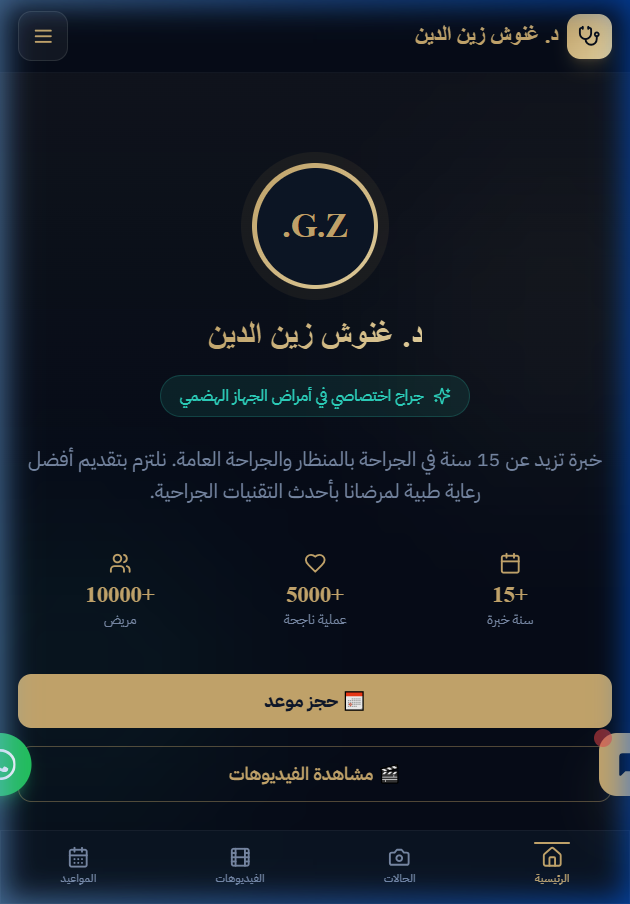

<div align="center">
  
  <h1 align="center">د. غنوش زين الدين — جراح اختصاصي</h1>
  <p align="center">
    <strong>المرافق الطبي الرقمي والموقع الرسمي للدكتور غنوش زين الدين — تخصّص أمراض الجهاز الهضمي والعمليات عبر المنظار</strong>
  </p>
  
  <p align="center">
    <a href="#المميزات-الرئيسية">المميزات</a> •
    <a href="#التقنيات-المستخدمة">التقنيات</a> •
    <a href="#التثبيت-المحلي">التثبيت</a> •
    <a href="#صور-التطبيق">صور التطبيق</a>
  </p>
</div>

---

## 📸 نظرة على التطبيق (Preview)



---

## 🌟 المميزات الرئيسية

يمثل هذا المشروع بيئة متكاملة بين تعريف الطبيب وتقديم وسائل تواصل وحجز مواعيد آمنة وسهلة للمرضى.

- **🏥 هوية بصرية فاخرة:** تصميم عصري (Dark Navy & Gold) يعكس الاحترافية والفخامة الطبية مع مونوغرام حصري **G.Z.**
- **🤖 المساعد الطبي الذكي (AI Triage):** روبوت محادثة مدمج للفرز الطبي المبدئي. يوجه المريض للحالات الاستعجالية أو يبسّط له عملية حجز موعد بناءً على إجاباته الطبية.
- **📱 تطبيق قابل للتثبيت (PWA):** يمكن للمرضى والأطباء تثبيت الموقع على هواتفهم (WebAPK) مع أيقونات وتجربة مستخدم شبيهة بالتطبيقات الأصلية.
- **🔒 لوحة تحكم محمية:** يمكن للطبيب من خلال لوحة التحكم الخاصة به (/dashboard):
  - إدارة حجوزات المواعيد والرسائل الواردة.
  - إضافة أو إزالة الفيديوهات الطبية.
  - إعداد المساعد الذكي وحالته.
- **🚀 تحسينات الأمان (Security):** جدار حماية (Supabase RLS)، حماية ضد (XSS & CSRF)، وRate Limiting لنموذج الاتصال وروبوت الدردشة للوقاية من البريد المزعج (Spam).

---

## 🛠 التقنيات المستخدمة

تم بناء المشروع باستخدام أحدث التقنيات القوية والسريعة:

- **إطار العمل:** Next.js 14+ (App Router)
- **لغة البرمجة:** TypeScript
- **التصميم والواجهة:** Tailwind CSS & Framer Motion (للأنيميشن السلس)
- **قاعدة البيانات:** PostgreSQL (برعاية Supabase)
- **المُصادقة:** Supabase Auth (SSR Cookies)
- **الذكاء الاصطناعي:** Gemini 2.0 Flash / OpenRouter (المساعد الذكي)
- **أدوات الحماية:** CSP, Rate Limiters, Input Sanitization

---

## ⚙️ التثبيت المحلي (Local Development)

إذا أردت تشغيل المشروع على جهازك:

1. **قم بتثبيت الحزم (Dependencies):**
   ```bash
   npm install
   ```

2. **إعداد المتغيرات البيئية:** قم بإنشاء ملف `.env.local` وأضف المفاتيح السرية الخاصة بك:
   ```env
   # Supabase Keys
   NEXT_PUBLIC_SUPABASE_URL="YOUR_URL_HERE"
   NEXT_PUBLIC_SUPABASE_ANON_KEY="YOUR_ANON_KEY_HERE"
   SUPABASE_SERVICE_ROLE_KEY="YOUR_ROLE_KEY_HERE"

   # AI API Keys
   GEMINI_API_KEY="YOUR_GEMINI_KEY"
   OPENROUTER_API_KEY="YOUR_OPENROUTER_KEY"

   # Encryption
   ENCRYPTION_KEY="32_CHARACTER_STRONG_KEY"
   ```

3. **شغّل سيرفر التطوير:**
   ```bash
   npm run dev
   ```

4. افتح `http://localhost:3000` في متصفحك وسترى النتيجة.

---

> © 2026 د. غنوش زين الدين — صُنع بأعلى معايير الجودة والأمان لراحة المرضى.
